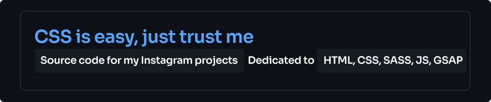

<h1 align="center">Hi 👋 Let me show that CSS is easy!</h1>
<h3 align="left">My favorite languages & frameworks</h3>

 

<h3 align="left">I also love this tools</h3>

 

- 📝 I post regularly content on my Instagram page [**https://instagram.com/cssiseasy/**](https://instagram.com/cssiseasy/). For more than four years, I have had many opportunities to work in a wide range of web technologies, which has allowed me to accumulate a significant amount of diverse experience.
- 🤖 In this github I'll be posting source code for all my instagram projects.
- 👾 Unfortunately, I am not available for hire or to work on your projects. But I will be happy to help you if you have a question or a bug in the code.
- 🦾 In the future I would like to teach you more complex things than CSS.

&nbsp;

